<p align="center"><a href="#">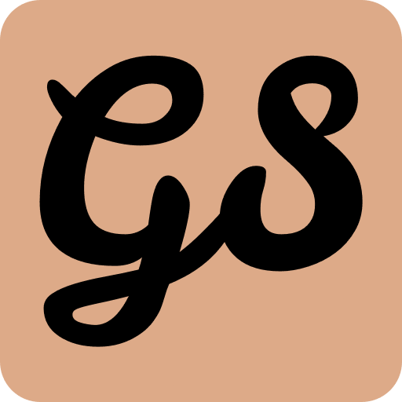</a></p>
<h1 align="center">GetStarted – Minimal & Fast Startpage</h1>
<p align="center">Minimal & fast startpage for you browser.</p>

<p align="center">
<a href="https://chromewebstore.google.com/detail/getstarted-minimal-fast-s/gegjomjnkboaliomeoedmdgefofeplgc"></a>
<a href="https://addons.mozilla.org/en-US/firefox/addon/getstarted-startpage/"></a>
<a href="https://apps.microsoft.com/detail/0RDCKG2QPN6W?referrer=appbadge&launch=true&mode=full">
	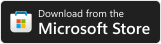
</a>
</p>
<p align="center">
<a href="https://chromewebstore.google.com/detail/getstarted-minimal-fast-s/gegjomjnkboaliomeoedmdgefofeplgc"></a>
<a href="https://addons.mozilla.org/en-US/firefox/addon/getstarted-startpage/"></a>
<a href="https://github.com/mralpha786/getstarted/releases/latest"></a>
<a href="/LICENSE"></a>
</p>

## Screenshots

<!-- <p align="center">

</p>
<hr/> -->

[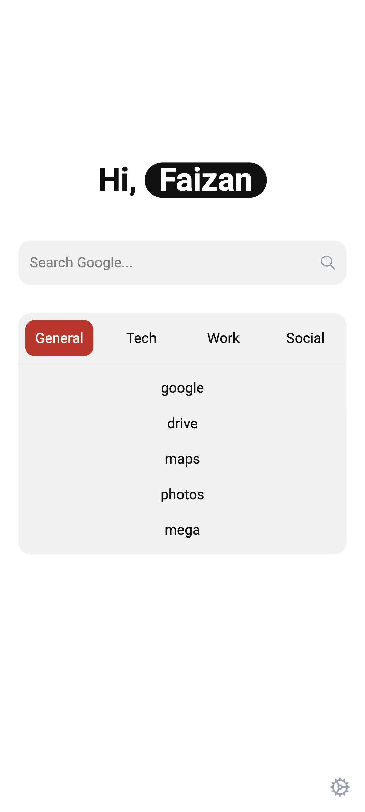](asset/phone-light.png)
[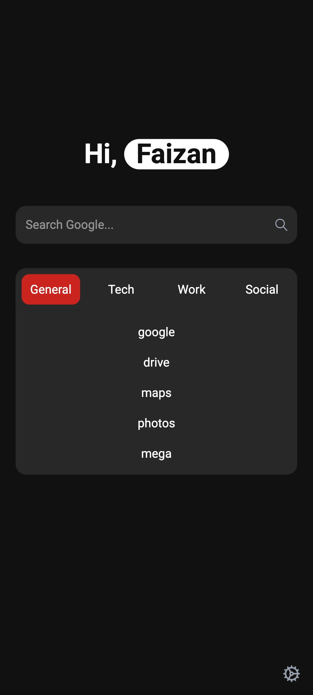](asset/phone-dark.png)
[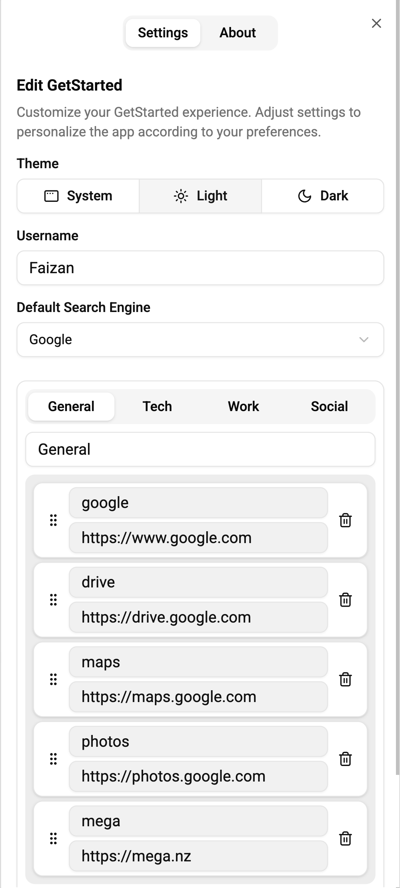](asset/phone-settings-light.png)
[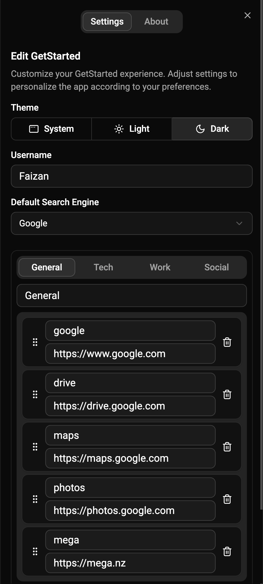](asset/phone-settings-dark.png)
<br/>
[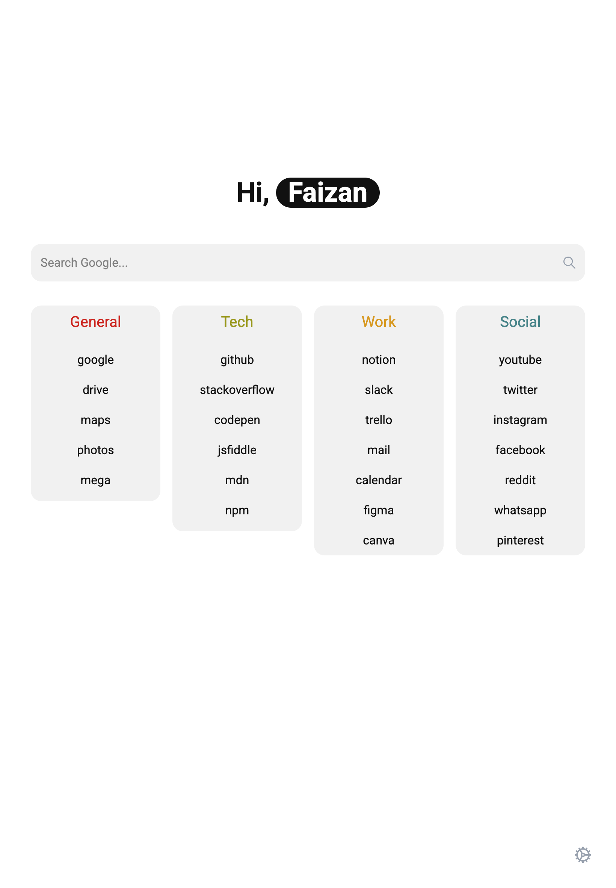](asset/ipad-light.png)
[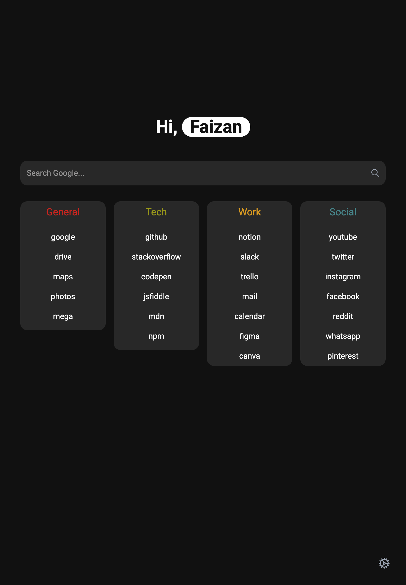](asset/ipad-dark.png)
[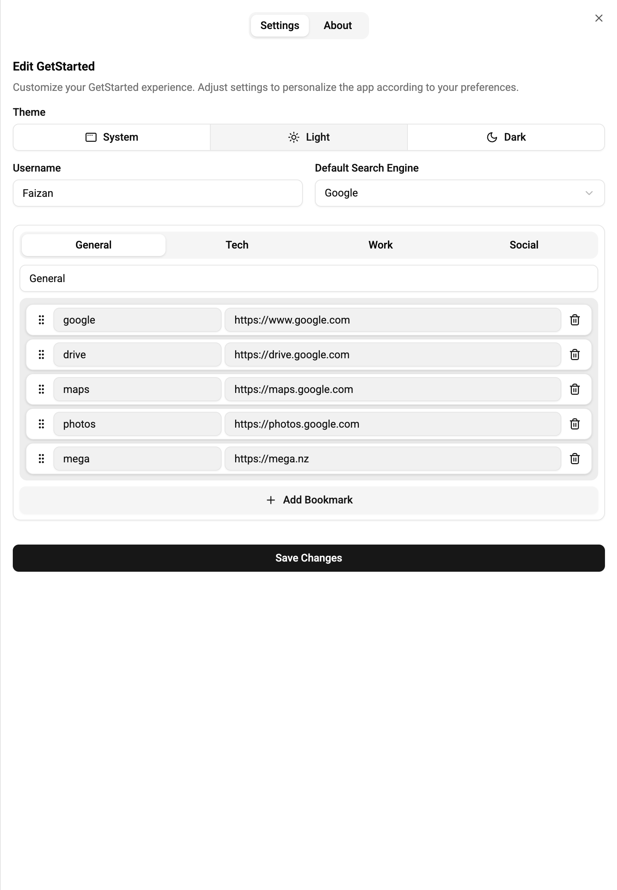](asset/ipad-settings-light.png)
[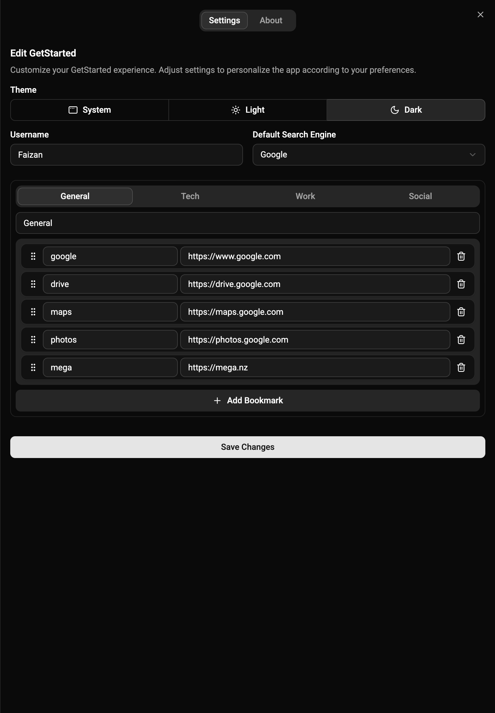](asset/ipad-settings-dark.png)
<br/>
[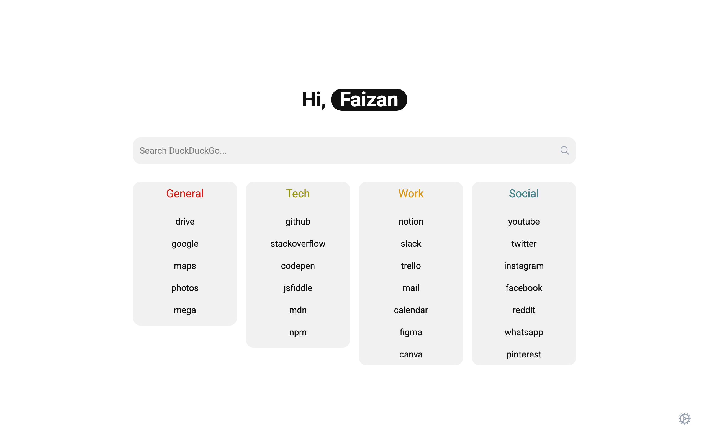](asset/desktop-light.png)
[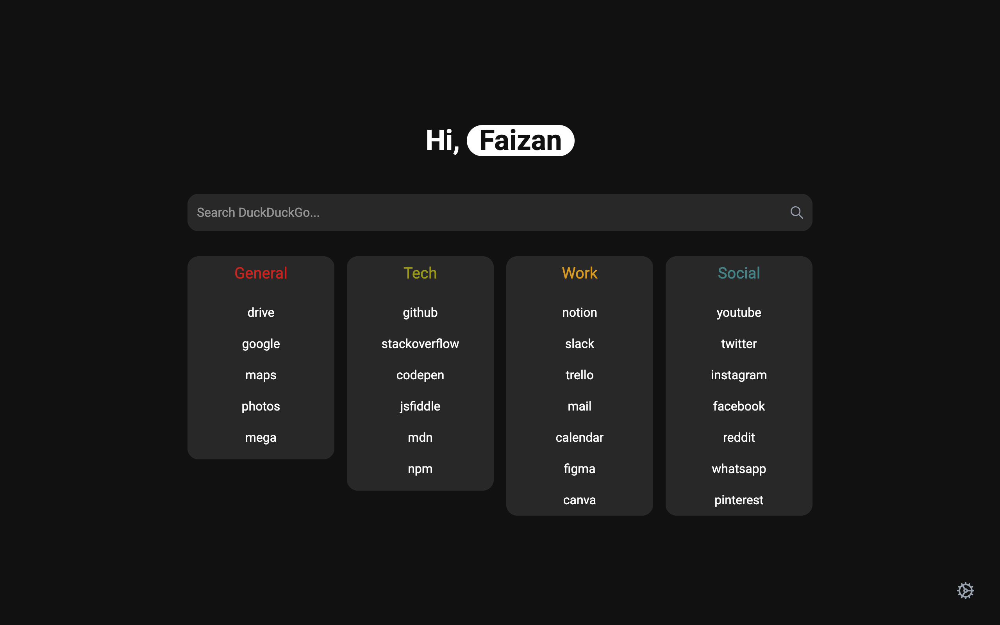](asset/desktop-dark.png)
[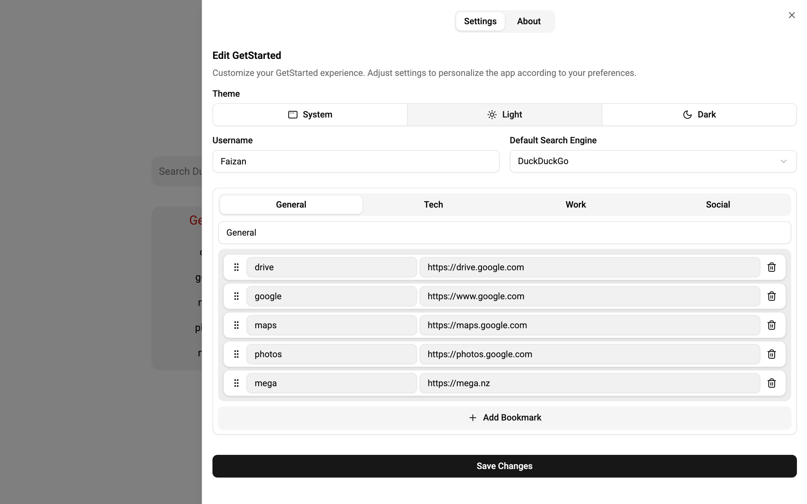](asset/desktop-settings-light.png)
[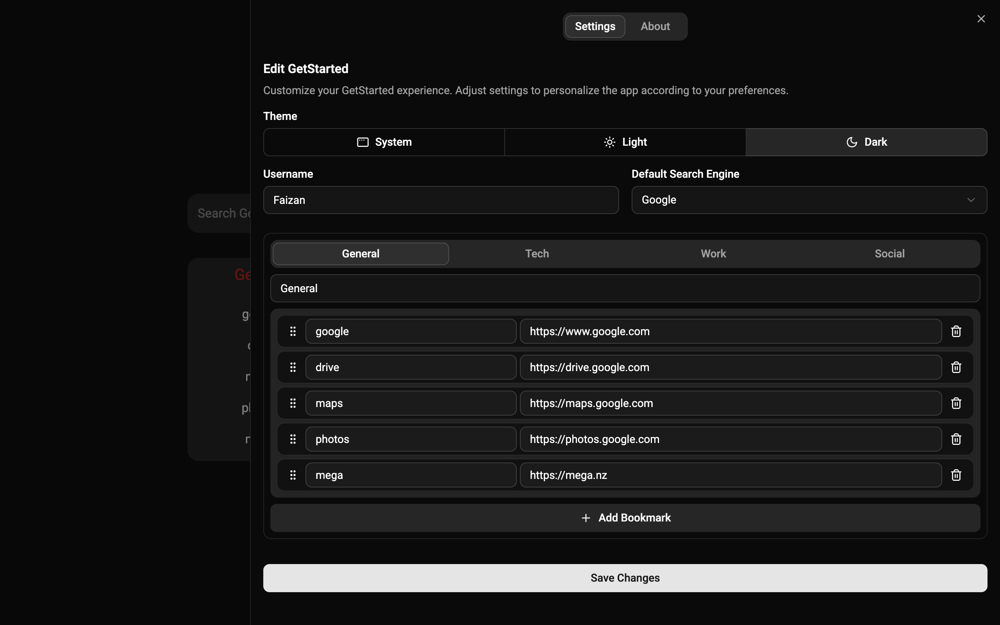](asset/desktop-settings-dark.png)

## Description

GetStarted replaces your browser's default new tab with a distraction-free startpage. It focuses on simplicity, clarity, and utility. You get a centered search bar and your most important bookmarks grouped into categories. That's it.

This extension works across Chrome, Firefox, and Safari. Your settings are automatically synced using browser sync storage. It’s responsive and works across all screen sizes.

### Features

- Light and dark mode toggle
- Configurable bookmarks with categories
- Responsive layout for all screen sizes
- Automatic syncing of settings using browser sync storage
- Settings preserved locally across sessions
- Built-in search bar and keyboard navigation

## Installation

### Available on:

- [Chrome Web Store](https://chromewebstore.google.com/detail/gegjomjnkboaliomeoedmdgefofeplgc?utm_source=item-share-cb)
- [Firefox Add-ons](https://addons.mozilla.org/en-US/firefox/addon/getstarted-startpage/)

### Manual Installation For Testing Purposes

1. Go to [Latest Release](https://github.com/mralpha786/getstarted/releases/latest)
2. Download the `.zip` for your browser:
   - `getstarted-*-chrome.zip`
   - `getstarted-*-firefox.zip`
   - `getstarted-*-safari.zip`
3. Unzip and follow your browser’s guide to install unpacked extensions:

#### Chrome

1. Open `chrome://extensions/`
2. Enable Developer mode
3. Click Load unpacked and select the extracted folder

#### Firefox

1. Open about:debugging
2. Click This Firefox
3. Click Load Temporary Add-on and select manifest.json in the extracted folder

#### Safari

1. Open `Settings` and go to the `Advanced` tab
2. Enable `Show features for web developers`, a new `Developer` tab will be added to settings.
3. Go to `Developer` and click Add Temporary Extension
4. Select the extracted folder and enable extension.

## 🛠️ Development

### Requirements

- Nodejs (v22)
- pnpm (v10.13.1)

### Initial setup

```bash
pnpm install
```

### To test in development

```bash
pnpm run dev
```

### To test as an extension

```bash
pnpm run build
pnpm run bundle firefox
```

- Build will be in `/dist` and a zipped version will be in `/artifects`.
- Follow the [Manual Installation Instruction](#manual-installation-for-testing-purposes)

> [!Caution]
> `/dist` is hardcoded as the default build location. A lot of scripts (e.g. `npm run bundle`) check for files in this directory.

> [!Note]
> `pnpm run bundle` require `chrome`, `firefox`, or `safari` as a required argument.

# Contributions

Contributions are welcome. Please open an issue to discuss any changes before submitting a pull request. Ensure code is linted, tested, and adheres to the project's style.

# Donation

If you find this extension helpful and would like to support its ongoing development, consider making a donation. Your contribution helps cover the costs of development, testing, browser publishing fees, and maintaining the project over time.

**Remember:** GetStarted will always remain free and open source. But if you'd like to show your appreciation, even a small amount goes a long way.

<a href='https://ko-fi.com/mfaizanx/tip' target='_blank'></a>

Thank you for your support!

# License

MIT License - see [LICENSE](./LICENSE) for details.
